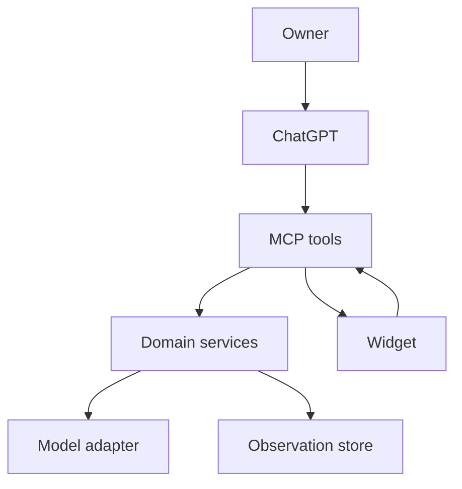
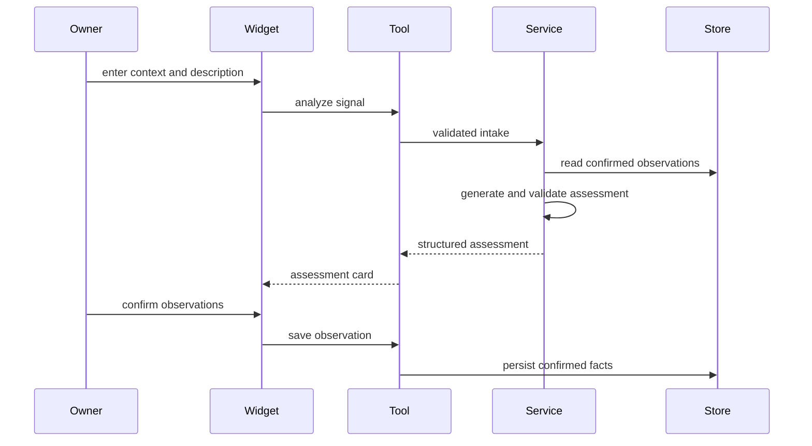
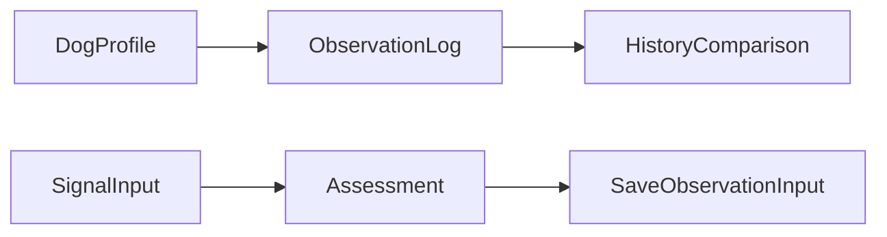

# 設計書

## 概要

PawLensは、来客またはチャイムへの吠えに迷う飼い主へ、ガイド付き記述、状況、任意の画像、同一会話内の確認済み観察を基にした4項目の見立てカードを返す。カードは状態仮説、確信度と限界、観察ポイント、安全な次の一手で構成する。

AIの仮説は検証・表示後に破棄し、履歴比較に使うのは飼い主が確認した観察だけとする。音声クリップは能力プローブが成功した環境でのみ補助入力として有効化する。初期実装は、指定雛形のpnpmモノレポとCloudflare Workers上のMCPサーバー構造を採用する。

### 目標

- 添付に依存しない来客時の吠えの主要フローを提供する。
- 不確実性、限界、根拠、専門家導線を常に可視化する。
- 同一会話内の2回目の見立てで、確認済み事実だけを比較する。
- テスト可能なMCPサーバーとアクセシブルなインラインウィジェットを提供する。

### 非目標

- 犬のセリフ生成、断定翻訳、医療・行動診断。
- 動画、ハードウェア、連続監視、会話をまたぐ履歴保証。
- 能力プローブと評価前の音声由来の主張。

## 境界の確約

### このSpecが責任を持つもの

- プロフィール、ガイド付き入力、見立て、確認済み観察、同一会話内比較、削除の契約。
- Apps SDKの現在のリソース・ツール記述子と、ウィジェットに返す構造化結果。
- 4状態、緊急性表示、ローカライズ、アクセシビリティを含むPawLensウィジェット。

### 責務外

- 認証済みID、会話を越える継続履歴、獣医・専門家側の業務、動画・ハードウェア。
- GPT LiveまたはRealtimeの実装。記述優先のMVPには不要である。

### 許可する依存関係

- Apps SDK / MCP SDK、Hono、Cloudflare Workers、pnpmワークスペース、Vitest。
- OpenAIの構造化生成、Zod、Workers KV、自己完結したReactウィジェット。
- リポジトリ内の選定済み研究コンテキスト。見立て中の任意Web検索は行わない。

### 再検証トリガー

- Apps SDKのツール・リソース・ファイル入力・UI bridgeの契約変更。
- 音声証拠の有効化、出力スキーマの変更、新しい状況を来客同等に扱う変更。
- 保存データ、IDの範囲、削除の意味、比較根拠の変更。

## アーキテクチャ

### パターンと境界

パターンはレイヤー化した機能スライスとする。MCPツールは薄いアダプタ、ドメインサービスは安全・永続化不変条件、ウィジェットは検証済み出力の表示を担当する。共有層は、アプリ固有の副作用を持たない契約・メッセージ・定数・純粋関数だけを提供する。依存方向は **shared → ドメイン → リポジトリ・モデルアダプタ → MCPツール → ウィジェット** とし、右側から左側への逆向き参照を禁止する。



- `AssessmentService`は見立ての組み立てを所有し、`Assessment`を保存しない。
- `ObservationService`は確認済み観察だけを書き込む唯一の経路である。
- `AudioEvidenceAdapter`は能力プローブが成功するまで無効である。
- Workerは指定雛形と同様に`createApp`で組み立て、ツール依存を注入可能にする。`/health`と`/mcp`を分け、DELETE時にはMCP接続を閉じる。

### 技術スタック

| レイヤー | 選択 | 役割 | 備考 |
|---|---|---|---|
| ワークスペース | pnpm workspace | MCPとウィジェットを分離 | 指定雛形の構成を採用 |
| ウィジェット | React / Vite | アクセシブルな見立てカード | Apps SDKリソースとして配信 |
| ツールサーバー | TypeScript / MCP SDK / Apps SDK | 型付きMCPツール・UIリソース | `ui://`契約を使用 |
| HTTPランタイム | Hono / Cloudflare Workers | Streamable HTTPとヘルスチェック | `createApp`で組み立て |
| 検証 | Zod | 入出力スキーマの唯一の真実源 | `any`を使わない |
| 保存 | Workers KV | 最小プロフィールと確認済み観察 | 結果整合。同一会話比較はread-your-writesで補完 |
| テスト | Vitest | 単体・結合・契約テスト | 雛形の検証パターンを採用 |

## ファイル構成計画

```text
pkgs/
├── mcpserver/
│   ├── src/
│   │   ├── index.ts                    # createApp、health、MCP接続ライフサイクル
│   │   ├── env.ts                      # Workerバインディングの型
│   │   ├── mcp/server.ts               # UIリソースとツールの登録
│   │   ├── mcp/tools.ts                # 4つのツールアダプタ
│   │   ├── openapi.ts                  # ZodスキーマからOpenAPI文書を生成
│   │   ├── assessment-service.ts       # 見立ての組み立て
│   │   ├── observation-service.ts      # 確認済み観察の書込境界
│   │   ├── history-diff.ts             # 事実だけの比較
│   │   ├── guardrails.ts               # 安全・言語・限界の検証
│   │   ├── model.ts                    # 構造化生成の境界
│   │   ├── research-context.ts         # 選定済み研究根拠
│   │   ├── audio-evidence.ts           # 能力プローブと任意音声証拠
│   │   └── repositories.ts             # プロフィール・観察のKV永続化
│   ├── src/__tests__/                  # 単体・結合テスト
│   ├── package.json                    # Worker依存とコマンド
│   ├── wrangler.toml                   # Worker・KV・静的アセット設定
│   └── openapi.yaml                    # MCPツール・healthの検証用OpenAPI成果物
├── widget/
│   ├── src/main.tsx                    # ウィジェット起動
│   ├── src/app.tsx                     # empty/loading/success/errorの状態遷移
│   ├── src/openai-runtime.ts           # 型付きUI bridgeアダプタ
│   ├── src/components.tsx              # カード、緊急性、観察、履歴、エラー
│   ├── src/styles.css                  # トークン、テーマ、モーション、フォーカス
│   └── package.json                    # バンドル依存とコマンド
└── shared/
    └── src/
        ├── contracts.ts                # MCPとウィジェットで共有するTypeScript型
        ├── schemas.ts                  # 共有Zod入出力スキーマと型導出
        ├── error-messages.ts           # ja/enの表示可能なエラーキーと文言
        ├── constants.ts                # ロケール、状況、確信度、能力フラグの定数
        └── utils.ts                    # 日時、ファイル参照、比較に使う純粋関数
tests/
├── e2e/mcp-flow.test.ts                # MCPから保存・比較までの通しテスト
└── evals/pawlens-cases.json            # 要件由来の評価ケース
package.json                            # ルートスクリプト
pnpm-workspace.yaml                     # パッケージ定義
biome.json                              # lint/format設定
```

全ファイルは新規作成である。`shared`はMCPサーバーとウィジェットの双方が読む副作用なしの層であり、Workerバインディング、KVアクセス、モデル呼び出し、`window.openai`への依存を持たない。x402、天気API、別バックエンドWorkerは構成に含めない。

共有ファイルの完全パスは、`pkgs/shared/src/contracts.ts`、`pkgs/shared/src/schemas.ts`、`pkgs/shared/src/error-messages.ts`、`pkgs/shared/src/constants.ts`、`pkgs/shared/src/utils.ts`である。

`pkgs/mcpserver/openapi.yaml`は、`pkgs/mcpserver/src/openapi.ts`が共有Zodスキーマから生成し、リポジトリへコミットする検証成果物である。手編集を禁止し、共有スキーマ変更時は生成・差分確認を必須にする。

## システムフロー



部分的に利用できる証拠だけがある場合、検証済みかつ安全な部分結果を返す。そうでない場合は行動可能なエラーを返す。2回目の見立ては同一会話・同一`dogId`の確認済み観察だけを読む。

## 要件トレーサビリティ

| 要件 | 要約 | コンポーネント | 契約 | フロー |
|---|---|---|---|---|
| 1.1, 1.2, 1.3, 1.4 | プロフィールと個体名 | repositories、Widget | `manage_dog_profile` | 見立て |
| 2.1, 2.2, 2.3 | 記述、状況、画像 | AssessmentService、Widget | `SignalInput` | 見立て |
| 2.4, 2.5 | 条件付き音声と代替 | AudioEvidenceAdapter | `AudioEvidence` | 見立て |
| 2.6, 2.7 | 較正と情報不足 | Guardrails | `Assessment` | 見立て |
| 3.1, 3.2, 3.3, 3.4 | 4項目と非診断 | model、Guardrails、Widget | `Assessment` | 見立て |
| 3.5, 3.6, 3.7 | 根拠と低確信度 | research-context、Widget | `EvidenceSource` | 見立て |
| 4.1, 4.2, 4.3, 4.4, 4.5 | 観察と安全行動 | Widget、ObservationService | `SaveObservationInput` | 保存 |
| 5.1, 5.2, 5.3 | 緊急性と安全案内 | Guardrails、Widget | `Urgency` | 見立て |
| 6.1, 6.2, 6.3, 6.4, 6.5 | 記録と比較 | ObservationService、HistoryDiff、repositories | `ObservationLog` | 保存 |
| 7.1, 7.2, 7.3, 7.4, 7.5 | 処理・失敗・部分成功 | AssessmentService、Widget | `AppState` | 見立て |
| 8.1, 8.2, 8.3, 8.4, 8.5, 8.6 | 言語・表示・アクセシビリティ | OpenAIRuntime、Widget | `WidgetContext` | 見立て |
| 9.1, 9.2, 9.3, 9.4 | 通知・最小保存・削除 | repositories、Widget | `DeleteProfileInput` | 保存 |

## コンポーネントとインターフェース

| コンポーネント | 役割 | 要件 | 主要依存 | 契約 |
|---|---|---|---|---|
| MCPツール | 4つの操作を検証・公開 | 1–9 | Apps SDK | API |
| AssessmentService | 安全な一時見立てを組み立てる | 2, 3, 5, 7 | model | Service |
| ObservationService | 確認済み事実だけを保存する | 4, 6, 9 | repositories | Service |
| repositories | プロフィールと観察のライフサイクル | 1, 6, 9 | KV | Service |
| HistoryDiff | 確認済み事実を比較する | 6 | repositories | Service |
| Widget | 表示と明示的なユーザー操作 | 1–9 | OpenAIRuntime | State |

### AssessmentService

- `SignalInput`を検証し、選定済み研究コンテキストと確認済み観察を組み合わせて、`AssessmentResult`または型付き失敗を返す。
- 生成後に非診断、犬の一人称禁止、限界文必須、確信度、根拠分離、緊急性、来客外の較正文を決定的に検査する。
- プロフィール・観察を書き込まない。

```typescript
type Confidence = "low" | "medium" | "high";
type Locale = "ja" | "en";

interface SignalInput {
  dogId: string;
  locale: Locale;
  context: "visitor" | "doorbell" | "unknown" | "other";
  barkDescription: string;
  precedingEvent: string | null;
  distanceToPerson: string | null;
  image: FileReference | null;
  audio: FileReference | null;
}

interface AssessmentService {
  assess(input: SignalInput): Promise<AssessmentResult>;
}
```

音声は`AudioEvidenceAdapter`が`available`を返した場合だけ使う。Zod検証に失敗した出力は1回だけ修復し、再失敗時は生の出力を表示しない。

### ObservationServiceとHistoryDiff

- `SaveObservationInput`は飼い主が選んだ観察と主行動だけを受け取る。仮説、確信度、限界、モデル根拠を受け取るフィールドを持たない。
- `HistoryDiff`は同一`dogId`かつ同一`conversationId`の`ObservationLog`だけを比較する。

```typescript
interface ObservationLog {
  id: string;
  dogId: string;
  conversationId: string;
  observedCues: readonly string[];
  chosenAction: string;
  recordedAt: string;
}

interface ObservationService {
  save(input: SaveObservationInput): Promise<ObservationLog>;
  compare(input: ComparisonInput): Promise<HistoryComparison>;
}
```

比較可能な記録がない場合は`unavailable`を返し、推測を生成しない。プロフィール削除は確認後に紐づく観察を連鎖削除する。

Workers KVは結果整合であり、保存直後の読取が最新の`ObservationLog`を返す保証がない。このため`save_observation`は保存した`ObservationLog`全体を構造化結果として返し、ウィジェットは保存済みログを自身のstateに保持する。`ComparisonInput`は任意の`recentLogs: readonly ObservationLog[]`（ウィジェットが保持する保存応答）を受け取り、`HistoryDiff`はKV読取結果と`id`で重複排除してマージする。これにより、KVの伝播遅延中でも同一会話内の2回目比較が決定的に成立する（6.3）。`recentLogs`も`scopeId`検証を通し、他スコープのログ混入を拒否する。

### MCPツールとUIリソース

| ツール | 可視性 | 入力 | 出力 | 副作用 |
|---|---|---|---|---|
| `manage_dog_profile` | model / app | プロフィールまたは削除命令 | 要約 | 更新・削除 |
| `analyze_dog_signal` | model / app | `SignalInput` | `AssessmentResult` | 読取のみ |
| `save_observation` | app | 確認済み観察と行動 | `ObservationLog` | 保存 |
| `get_dog_history` | model / app | 個体・会話ID | `HistoryComparison` | 読取のみ |

`analyze_dog_signal`は出力スキーマと`_meta.ui.resourceUri`を宣言する。画像・音声は機能が有効な場合のみトップレベルのファイルパラメータとして宣言する。変更系ツールは破壊性・冪等性を正しく宣言する。

### IDの提供源とデータスコープ

- `conversationId`をモデル生成の引数として信用しない。WorkerがStreamable HTTPセッション確立時に発行するサーバー生成セッションIDから`scopeId`を導出し、詐称不可能な会話スコープとして使う。
- KVキーは`owner:{scopeId}:dog:{dogId}`で範囲を切る。読取・比較・削除はすべて同一`scopeId`内に限定し、他スコープの`dogId`は存在しないものとして扱う。
- Apps SDKが会話単位で安定した識別子を提供するかは、実装前のリリースゲート「IDプローブ」で検証する。会話内でセッションIDが複数発行され得る場合は、比較を「比較できる記録がまだない」表示へ縮退させ、誤った差分を推測しない（6.4と同じ経路）。

### OpenAPI検証契約

- `openapi.yaml`はOpenAPI 3.1形式とし、`/health`のHTTPレスポンスと、4つのMCPツールの入力・出力スキーマを`components.schemas`および`x-mcp-tools`で公開する。
- `/mcp`はStreamable HTTP上のJSON-RPCであり、OpenAPIのRESTエンドポイントとして表現しない。`openapi.yaml`はMCPプロトコルを置き換えず、ツール契約の可視化、スキーマ検証、ヘルスチェック確認を目的とする。
- `x-mcp-tools`には、ツール名、可視性、read-only・破壊性・冪等性、引数スキーマ参照、出力スキーマ参照を記録する。`manage_dog_profile`の削除操作は破壊的であることを明示する。
- `/health`はサービス名、状態、バージョン、時刻を返す。秘密情報、KVの内容、モデル設定値を返さない。

```yaml
openapi: 3.1.0
paths:
  /health:
    get:
      operationId: getHealth
      responses:
        "200":
          description: MCP server is available
x-mcp-tools:
  - name: analyze_dog_signal
    inputSchema: "#/components/schemas/SignalInput"
    outputSchema: "#/components/schemas/AssessmentResult"
```

### shared層

- `schemas.ts`は`SignalInput`、`AssessmentResult`、`SaveObservationInput`、ファイル参照、削除確認のZodスキーマを所有する。MCPツールは境界検証に、ウィジェットは受信済み`structuredContent`の検証に同じスキーマを使う。
- `error-messages.ts`は`missing_input`、`unusable_image`、`generation_failed`、`partial_evidence`、`urgency`、`delete_confirmation`、`privacy_notice`、`media_privacy_notice`のメッセージキーと日本語・英語の文言を所有する。モデル出力をこの文言で置き換えず、決定的なシステムエラーと操作案内だけに使う。
- `privacy_notice`は収集するデータの種類、保存期間、削除方法、第三者提供の有無を説明する文言であり、ウィジェットがプロフィールまたは観察の初回保存前に表示する（9.1）。`media_privacy_notice`は写真・音声に個人情報が含まれる可能性の通知であり、添付入力の受付時に表示する（9.4）。
- `constants.ts`は許可ロケール、状況、確信度、最大音声長、能力フラグ名を定義する。値の変更は入力検証・UI表示・評価を再検証するトリガーである。
- `utils.ts`は副作用のない日付整形、ファイル参照の正規化、確認済み観察の比較補助だけを置く。ドメイン判断、永続化、翻訳、ネットワーク呼び出しは置かない。

### WidgetとOpenAIRuntime

ウィジェット状態は`"empty" | "loading" | "success" | "error"`である。インライン表示だけで主要情報を完結させ、詳細表示は明示操作でのみ開く。`OpenAIRuntime`はツール入出力、ロケール、テーマ、表示モード、`callTool`を型付きで包む。

- 仮説は可能性として表示し、低・中・高ラベルと限界文を常に併記する。百分率バーは使わない。
- 観察チェックは未選択で開始するネイティブチェックボックスとし、ローカル下書きと保存済み観察を分離する。保存応答の`ObservationLog`はstateに保持し、2回目比較の`recentLogs`として渡す。
- 初回の保存操作の前に`privacy_notice`を、写真・音声の添付時に`media_privacy_notice`を表示し、確認後にのみ保存・添付を進める。
- 読み込みはライブリージョンで通知し、低モーション設定では静的またはクロスフェードへ切り替える。緊急とシステムエラーはアイコン・文言・色のすべてで区別する。

## データモデル



- `DogProfile`: `id`, `name`, `temperamentNote`, `createdAt`, `updatedAt`。
- `ObservationLog`: `id`, `dogId`, `conversationId`, `observedCues`, `chosenAction`, `recordedAt`。
- `Assessment`は一時値であり、上記の永続エンティティに埋め込まない。
- KVキーは`dogId`で範囲を切り、プロフィール削除時に全ログを連鎖削除する。画像・音声URL・生の見立て・モデル根拠は保存しない。

## エラー処理と監視

| 分類 | 検知 | 表示 | 回復 |
|---|---|---|---|
| 入力不足 | 入力スキーマ | 不足した情報を説明 | 補足して再送信 |
| 画像不適合 | evidence adapter | 画像を使えない旨を表示 | 低確信度で継続 |
| モデル・スキーマ失敗 | Guardrails | 原因と再試行を表示 | 1回修復後にエラー |
| 部分証拠 | evidence adapter | 利用できた範囲を表示 | 未使用証拠を明示 |
| 緊急性 | Guardrails | 安全案内を優先 | 専門家導線を維持 |
| 削除要求 | repositories | 連鎖削除を確認 | プロフィールとログを削除 |

監視には相関ID、ツール名、結果種別、スキーマ失敗種別、能力フラグ、レイテンシを記録する。生のメディアURL、秘密情報、不必要な個人情報は記録しない。

## テスト戦略

### 単体・結合テスト

- Guardrailsが犬の一人称、診断表現、空の限界文、不正な確信度を拒否する（3.3、3.4、3.7）。
- ObservationServiceがAI仮説を拒否し、確認済み観察・行動・時刻だけを保存する（6.1、6.2）。
- HistoryDiffが同一会話だけを比較し、記録不足で`unavailable`を返す（6.3–6.5）。
- HistoryDiffがKV未伝播でも`recentLogs`とのマージで直前の保存を比較に含め、他`scopeId`のログを拒否する（6.3、9.2）。
- repositoriesが`owner:{scopeId}:dog:{dogId}`スコープ外の読取・削除を常に空・不成立として扱う（9.2、9.3）。
- `createApp`へ偽の依存を注入し、`/health`、`/mcp`、DELETE時の接続終了を検証する。
- `openapi.yaml`の生成結果をOpenAPI 3.1バリデータで検査し、`/health`、4ツール、全`x-mcp-tools`参照が共有Zodスキーマと一致することを検証する。
- `analyze_dog_signal`が記述、状況、任意画像、条件付き音声のツール契約を満たす（2.1–2.5）。
- プロフィール削除が確認後に全観察を消す（9.1–9.3）。

### ウィジェット・E2Eテスト

- 日本語・英語の依頼でカードの全テキストが選択言語になる（8.1、8.2）。
- empty、loading、success、urgent、partial、errorでキーボード操作・ラベル・低モーション表示を検証する（5.2、7.1、8.3、8.6）。
- 記述→見立て→観察確認→行動保存→同一会話の2回目比較を通す（1–6）。
- 状況不明・写真なしで低確信度の追加質問を返し、断定翻訳をしない（2.7、3.4、3.6）。
- 初回保存前に`privacy_notice`が、添付時に`media_privacy_notice`が選択言語で表示される（9.1、9.4）。

### リリースゲート

1. Hello Widget: versioned `ui://`リソースがインラインで描画され、構造化結果を受け取る。
2. 添付プローブ: ファイルパラメータが有効なファイルオブジェクトとしてツールへ届く。失敗時は音声を無効化する。
3. IDプローブ: 会話スコープの識別子が同一会話内で安定していることを検証する。不安定な場合は比較を`unavailable`へ縮退させる。
4. 評価: 来客、来客外、入力不足、画像不適合、緊急性、2回目比較、日本語、英語、削除をデモ前に実行する。

## セキュリティと移行

- 秘密情報はWorkerバインディングだけに置き、ツール結果、widget state、ログ、バンドルへ含めない。
- ウィジェットのCSPは必要なオリジンだけを宣言し、任意の外部アセットを読み込まない。
- 変更系ツールは明示ユーザー操作を必須にする。削除は連鎖範囲を確認する。
- 実装済みシステムや既存データはないため、データ移行は不要である。実装順は、WorkerとHello Widget、スキーマとリポジトリ、ガードレールとツール、ウィジェット、条件付き音声・評価とする。
