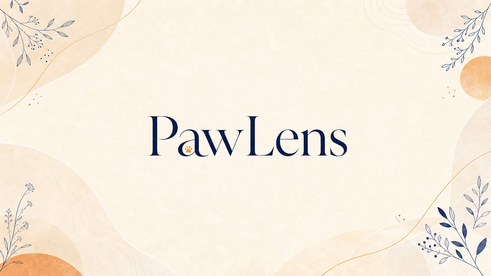
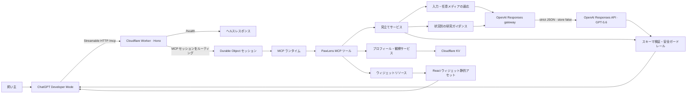

# PawLens Chat GPT Plugin

[English README](./README.md)



PawLens は、犬の反応についての飼い主の記述、状況、任意の画像・音声を、落ち着いて確認できる次の観察と行動に整理する ChatGPT App です。診断や「犬語の翻訳」は行わず、仮説・根拠の限界・飼い主が確かめるサインを分けて示します。犬との共生をもっと楽しく豊かにするためのプロダクトです。

録画用の英語・日本語プロンプトと進行台本は、[デモ運用ガイド](./docs/operation.md) を参照してください。

## Elevator pitch

> 犬との共生をもっと楽しく豊かにするプロダクトです。このプロダクトを使うことで愛犬と話すことができます！

## Built with Codex and GPT-5.6

PawLens は Responses API 経由で `gpt-5.6-sol` を使い、事実ベースの記述・状況・同一会話内で確認済みの観察を、構造化された観察ガイドに変換します。モデルは可能性、限界、観察点、低刺激の次の一手を提案します。

アプリ側では strict JSON Schema、最大1回の修復、媒体参照の検証、研究コンテキストの境界、生成後の安全ガードレール、緊急時のエスカレーション、保存前の飼い主確認を強制します。モデルの推測を「飼い主が確認した観察」として保存することはありません。

Codex は Cloudflare Worker MCP サーバー、React ウィジェット、MCP Apps bridge、Responses API gateway、KV 保存、ガードレール、テストを加速しました。Durable Object の休止で MCP transport 状態が失われる本番不具合も、セッションスコープを維持して再開リクエストを処理する設計へ修正しました。

- **Codex Session ID:** `019f8484-36e2-7b50-9ab2-901e6138d67a`
- **ライセンス:** [MIT License](./LICENSE)
- **制約:** PawLens は獣医学的・行動学的な診断や緊急判断の代替ではありません。音声はホストが安全な一時参照を提供できる場合だけ利用します。

## システムアーキテクチャ



Worker が MCP の経路とセッション復旧を担い、Durable Object が MCP セッションをスコープします。Cloudflare KV にはプロフィールと飼い主確認済みの観察だけを保存します。見立てでは、そのリクエスト中の任意メディア参照だけを Responses API に渡し、厳格な構造化結果を検証・ガードレール処理した後にウィジェットへ返します。

## 技術的な強み

PawLens は、モデルの文章をそのまま見せるのではなく、観察支援に必要な条件をアプリケーション側で確かめてから返します。そのため、もっともらしい説明よりも、飼い主が次に確認できることを優先できます。

- **出力を複数の段階で検証する。** Responses API の strict JSON Schema で形式を固定し、Worker で Zod 検証と決定的なガードレールを通します。診断表現、犬の一人称、緊急時に不適切な助言を含む結果は採用しません。検証に通らなければ最大1回だけ修復を試み、それでも失敗した場合は安全なエラーとして返します。
- **情報不足を推測で埋めない。** 吠える直前の出来事や人との距離が欠けると `partial` として必要な一点を尋ねます。来客・ドアベル以外の場面も、同じ確信度で扱いません。任意の画像・音声が使えなくても、その限界を明示して記述ベースの観察に戻れます。
- **仮説と記録を混ぜない。** KV に残せるのは飼い主が確認した観察だけです。モデルが示した可能性は保存せず、犬IDと会話スコープが一致する記録だけを見立てや履歴比較に使います。会話の同一性を確認できない場合は、履歴を推測せず `unavailable` を返します。
- **会話の継続性をインフラで支える。** Streamable HTTP の MCP セッションを Durable Object に閉じ込め、休止後はランタイムを復元して再開リクエストを処理します。長い会話の途中で、セッションが消えたことを理由にツールが使えなくなる問題を避けるための設計です。
- **扱うデータをリクエスト単位に絞る。** モデル呼び出しでは `store: false` を指定し、添付ファイルはその見立てに必要な短期参照だけを渡します。失敗ログにも、プロンプト・添付URL・応答本文を出しません。

## 機能一覧

| 機能 | 実装内容 | 現在の証拠・制約 |
| --- | --- | --- |
| PawLens ウィジェット | `show_pawlens_hello` が React 製 MCP ウィジェットを返し、プロフィールの下書きを表示できます。 | 提供された ChatGPT Developer Mode のスクリーンショットで表示を確認済みです。 |
| 犬プロフィール | `manage_dog_profile` が Cloudflare KV 上でプロフィールを作成・更新・確認付き削除します。 | プロフィールのウィジェット表示を確認済み。削除は現在の ChatGPT フローでは未実演です。 |
| 犬の反応の見立て | `analyze_dog_signal` が事実の記述、状況、距離、任意メディア、研究ガイダンス、確認済み観察を統合します。 | 通常・情報不足・緊急の公開実モデル eval を確認済みです。 |
| 構造化・安全な出力 | Responses API の strict JSON Schema、Zod 検証、最大1回の修復、非診断・緊急時ガードレールを適用します。 | `success`、`partial`、`urgent`、安全な `error` を返します。 |
| 任意の画像・音声 | 画像・音声参照を受け付け、音声が使えないときは安全側に倒して記述だけで続行します。 | 画像は任意。直接音声はホスト機能に依存し、審査の必須経路ではありません。 |
| 飼い主確認済み観察の保存 | `save_observation` はウィジェットからのみ呼び出せ、モデルの仮説を事実として保存しません。 | 実装・テスト済みですが、現在の ChatGPT 接続では保存 UI が使えないため、審査時に永続化を期待しないでください。 |
| 同一会話内の履歴比較 | `get_dog_history` は、安定した会話が確認できる場合だけ、保存済みの確認観察を比較します。 | 未保存のチャット文から履歴を推測せず、保証できない場合は `unavailable` を返します。 |
| MCP セッション復旧 | Streamable HTTP の `/mcp` を Durable Objects 経由で処理し、休止後も安全なトランスポートで再開します。 | 公開 Worker の初期化、ツール列挙、休止後復旧を確認済みです。 |
| 日本語・英語対応 | ホストのロケールでモデル出力とウィジェット表示を日本語または英語へ切り替えます。 | 日本語の Developer Mode スクリーンショットあり。英語も同じ契約で対応します。 |

## 事前条件

- Node.js 22 以降
- pnpm 9.12.3 以降
- デプロイには Cloudflare アカウント
- ChatGPT へ接続するには Developer Mode へのアクセス

```sh
pnpm install
pnpm run lint
pnpm run typecheck
pnpm run build
pnpm test
```

## ローカル実行と検証

```sh
pnpm --filter @pawlens/mcpserver dev
curl http://127.0.0.1:8787/health
```

ローカルの MCP URL は `http://127.0.0.1:8787/mcp` です。MCP Inspector では Streamable HTTP を選び、この URL を指定してください。`show_pawlens_hello`、`analyze_dog_signal`、`save_observation`、`get_dog_history`、`manage_dog_profile` が列挙されることを確認します。

```sh
npx @modelcontextprotocol/inspector --cli http://127.0.0.1:8787/mcp --transport http --method tools/list
```

## Cloudflare Workers へのデプロイ

`pkgs/mcpserver/wrangler.toml` の KV namespace を自分の Cloudflare アカウント用に設定し、API キーは必ず Worker Secret として登録します。

```sh
pnpm --filter @pawlens/mcpserver exec wrangler secret put OPENAI_API_KEY
pnpm run build
pnpm --filter @pawlens/mcpserver exec wrangler deploy
```

公開 URL:

```text
https://pawlens-mcpserver.avp-104-106-107-a78.workers.dev/mcp
```

デプロイ後に確認します。

```sh
curl https://pawlens-mcpserver.avp-104-106-107-a78.workers.dev/health
```

ログ監視には `pnpm --filter @pawlens/mcpserver exec wrangler tail pawlens-mcpserver` を使います。プロンプト、添付 URL、API キーをログへ出力しないでください。

## ChatGPT Developer Mode

1. ChatGPT の **Settings → Security and login** で **Developer mode** を有効化します。
2. **Settings → Plugins**（または Plugins ページ）で開発者モード用アプリを追加します。
3. 上記の公開 MCP URL を登録します。
4. 新しい英語会話で次のプロンプトを送ります。

```text
Open PawLens. My dog barked twice after the doorbell, stepped back about one meter, and looked stiff. Without diagnosing, organize what I can observe next and one calm action for tonight.
```

期待結果は、可能性、確信度、根拠の限界、観察点、低刺激の行動を含む PawLens カードです。Developer Mode 上で実際にウィジェットが表示されることは、提出動画を撮る前に必ず確認してください。

## 公開 Worker の検証記録

2026-07-21（JST）、Worker version `995bc305-3dde-4881-ac4c-e8b9c584ffaa` で以下を確認しました。

| 確認項目 | 結果 |
| --- | --- |
| `GET /health` | HTTP 200、`status: "ok"` |
| MCP `initialize` | protocol `2025-03-26` のネゴシエーションに成功 |
| MCP `tools/list` | 5つの PawLens ツールを取得 |
| Session recovery | Durable Object 休止後のツール呼び出しを回帰テストで確認 |
| 実モデル eval | 通常・情報不足・緊急の3ケースで期待する安全な結果を確認 |
| ChatGPT Developer Mode のウィジェット表示 | 制約付きで確認済み（ウィジェット・プロフィール表示は記録済み。現在の接続では確認済み観察の保存は利用不可） |

実モデル eval は臨床検証やベンチマークではありません。通常ケースでは `success`、情報不足では `partial` / low confidence、持続する強い震えでは `urgent` と安全な獣医師相談導線を返しました。生成結果は実行ごとに変わり得ます。

## 使用技術

ChatGPT Apps、Model Context Protocol、OpenAI Responses API、GPT-5.6、Codex、Cloudflare Workers、Durable Objects、Cloudflare KV、React、TypeScript、Hono、Vite、Vitest、JSON Schema、Zod。

## トラブルシューティング

- `/health` は通るが MCP Inspector が接続できない: URL の末尾が `/mcp` か、Transport が Streamable HTTP か確認します。
- ウィジェットが表示されない: `pnpm run build` を先に実行し、`show_pawlens_hello` と `ui://pawlens/hello-widget-v9.html` を Inspector で確認します。
- ChatGPT が接続できない: localhost ではなく公開 HTTPS URL を登録します。
- 音声が無効: 安全側の既定動作です。飼い主の記述・状況・任意の画像でフローを継続してください。

## 参考

- [OpenAI Apps SDK: Build your MCP server](https://developers.openai.com/apps-sdk/build/mcp-server)
- [OpenAI Apps SDK reference](https://developers.openai.com/apps-sdk/reference)
- [MCP Inspector](https://github.com/modelcontextprotocol/inspector)
